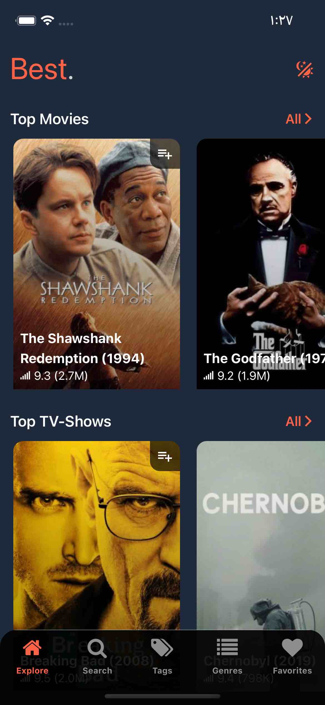
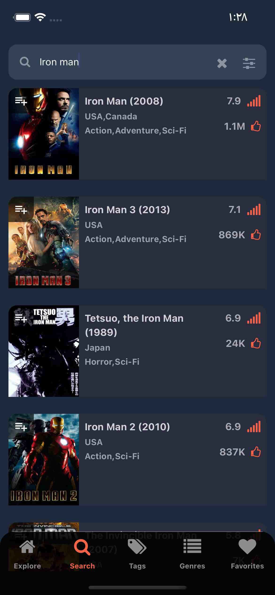
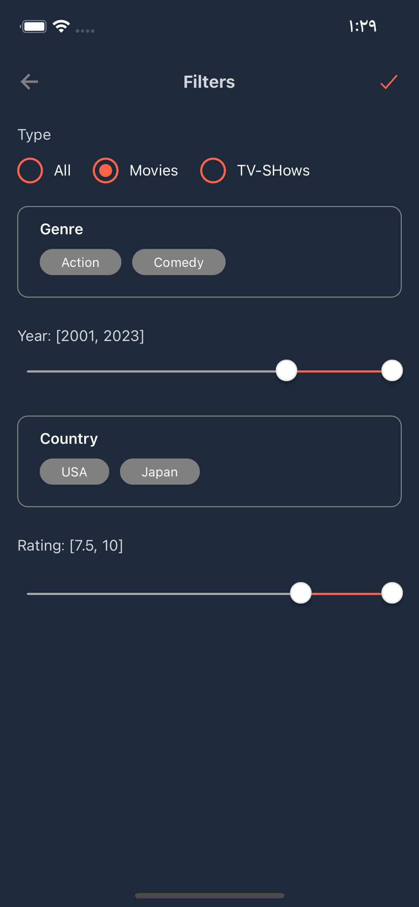
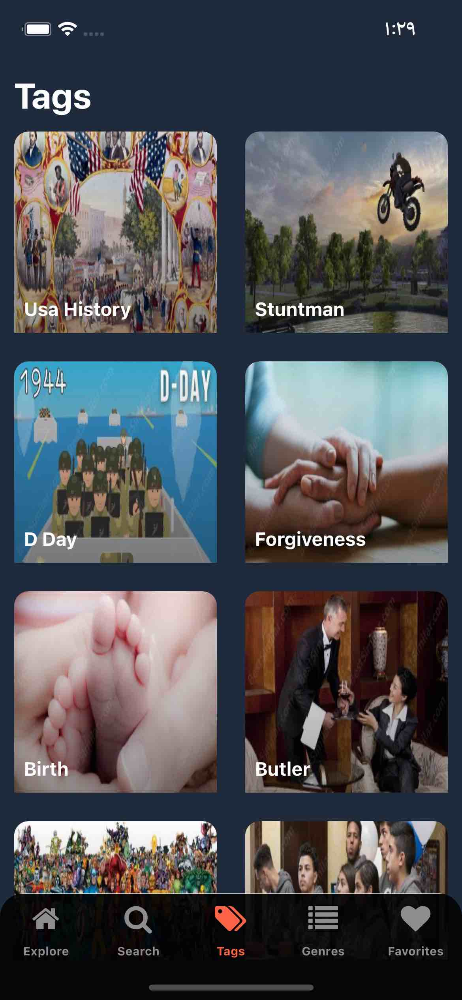
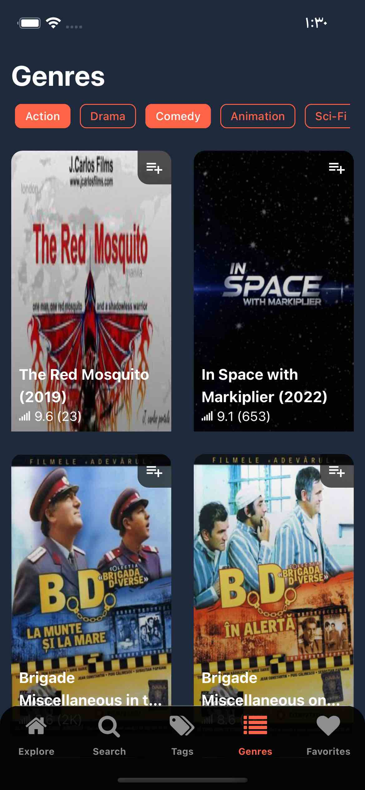
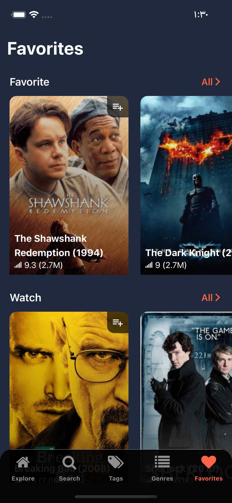

# RN Movies Similars App

✨ **This project has been created by React Native CLI** ✨

This is a React Native App for movies and Tv shows information .

## Run

**Install dependencies**

```
yarn
```

**Run**

```
yarn start
```

**Run iOS**

```
yarn ios
```

## 📱 Features

- Explore top movies and tv-shows.
- Explore top tags by styles, plot, places and time.
- Search and filtering by type (Movies, TV-Shows), Genre, year, country and rating.
- Save movies (or tv-shows) to favorites lists
- Display movie (or tv-shows) details and play trailers
- List top similars movies and tv-shows
- Light and Dark mode

## 🛠 Tech and Libraries

- [React Native](https://reactnative.dev/)
- [TypeScript](https://www.typescriptlang.org/)
- [React Navigation](https://reactnavigation.org/): Routing and navigation
- [React Query](https://react-query.tanstack.com/): Fetching, caching, synchronizing and updating server state
- [NativeWind](https://www.nativewind.dev/): uses Tailwind CSS to create a universal style system for React Native
- [Axios](https://github.com/axios/axios): Promise based HTTP client
- [Async Storage](https://react-native-async-storage.github.io/async-storage/): Data storage system
- [@testing-library/react-native](https://testing-library.com/docs/react-native-testing-library/intro/) React Native Testing Library

### App Screenshots







